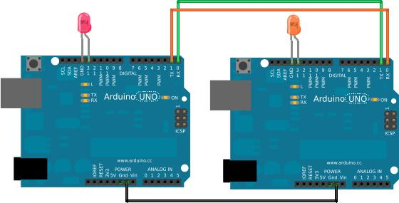
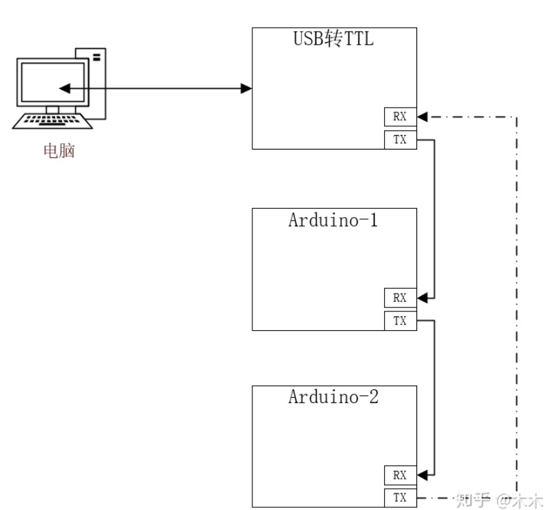
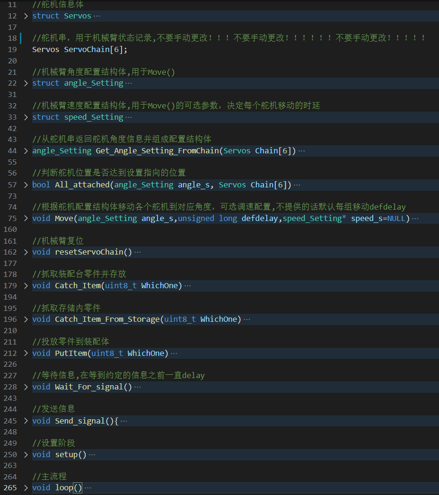
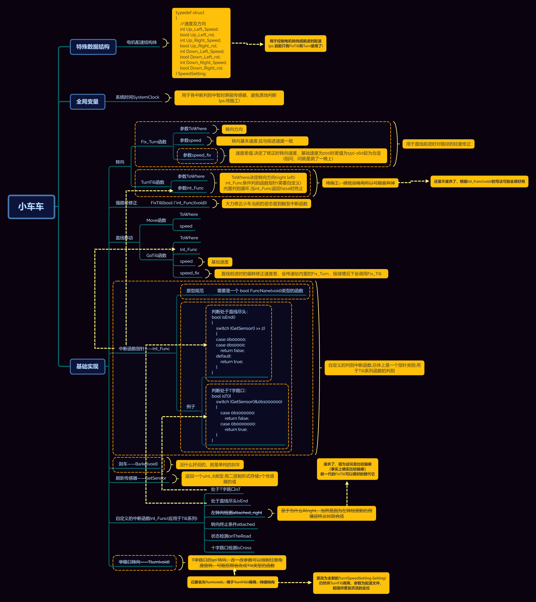
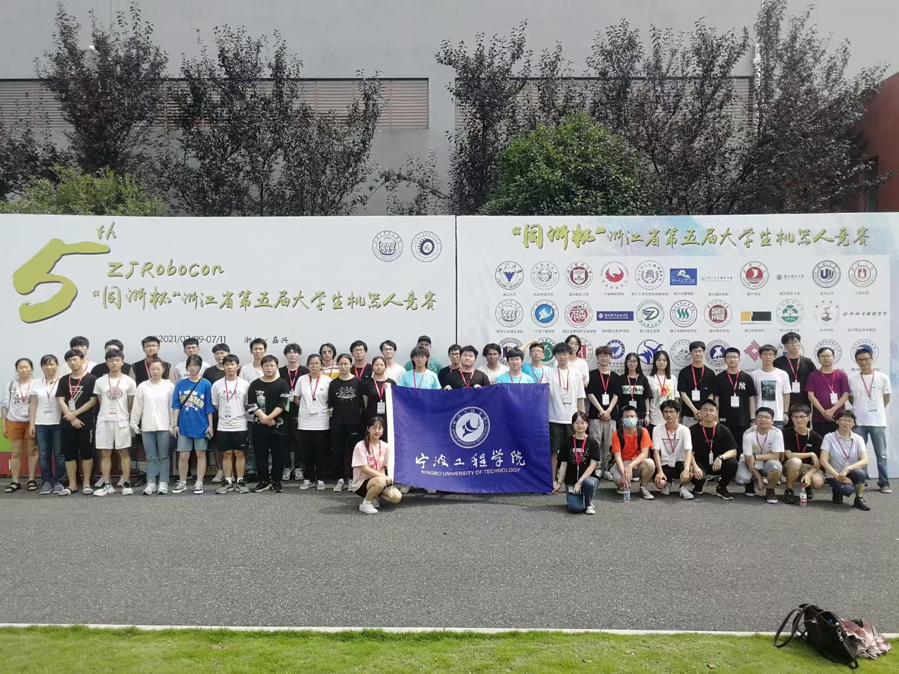
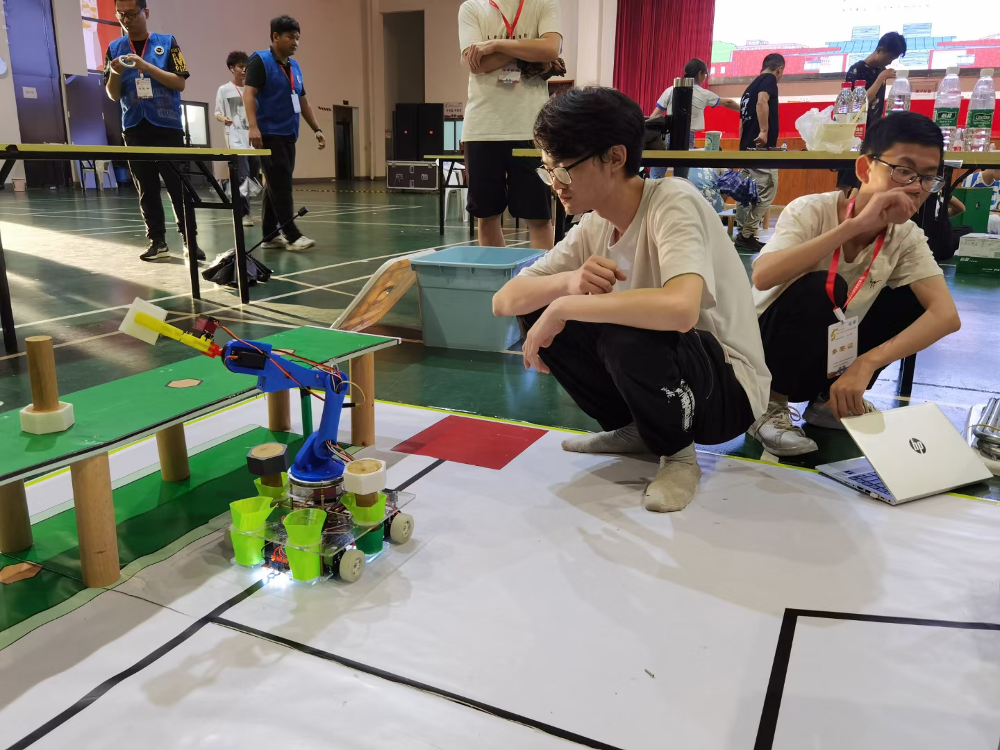
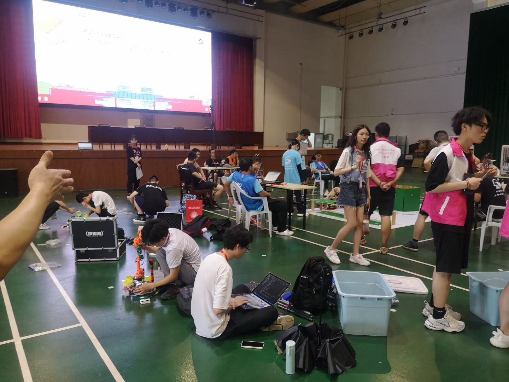
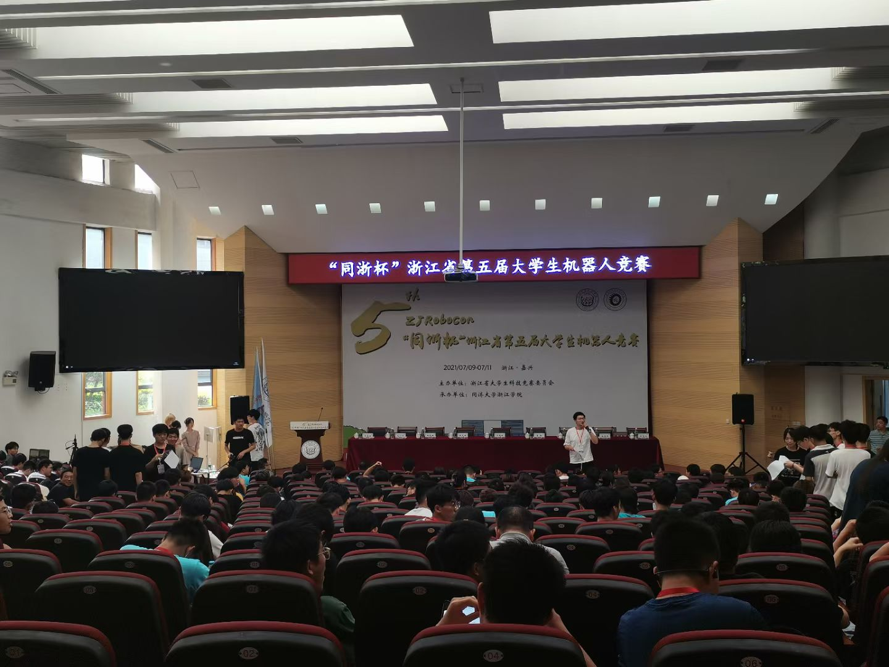

### 这是个啥？

这里是2021年7月浙江省赛装配小车的工程文件  
该赛事已于2021/07/11结束，此仓库最终整理后将会封存  
##### 写在前面的赛后总结(个人总结而已，可以直接跳到下面目录)
<details>
  <summary><b>[-点击展开-]</b></summary>
  
> _____虽然仍有遗憾，但结果是好的，三支队伍拿了两个三等奖 ~~真就全靠同行衬托~~ ，作为本人参与的第一个项目，也暴露出了现阶段的很多问题，例如机械结构设计的不合理性 **(串行舵机控制机械臂是真的傻\*\*\*)** 针对这个装配比赛有很多更合理的机械设计，例如丝杆滑轨投放，激光测距识别装配孔洞，成功率要比串行机械臂高很多也更稳定。  
 _____初期调试时总是把问题想的太死，例如强求底盘精准转向90°，实际上由于电机功率和电池电压问题会导致转向不精准，后续的修正算法才是真正意义上的精髓(于是有了FixTurn等等修正用函数)，在Till系列函数中有很多应用，这也是让底盘代码成为这次项目 **"一次编写，到处复制，哪都能跑"** 的真正功臣，是底盘代码的灵魂，后续的话应该会接触到更多的闭环控制算法，例如经典的PID，到时候再来审视这里的代码或许会有更不一样的理解。  
 _____至于这次比赛中出现的各种差错，最恼人的莫过于前一天晚上调得好好的车子后来上场只拿了1分，后来下场发现舵机线都断了几根，运输和接线方面的问题非常非常的值得反思，**保姆级别的保护其实一点都不过分**，调了半天以为调好了，上场，boom，哦豁玩脱，那才是最气人的。  
 _____总的来说，这次项目给我最大的感受就是前期规划和团队合作的重要性，前期规划做的不够好的话后期很容易事倍功半，例如想要实现某些功能时却发现当前机械结构根本不足以实现，想要修改却发现时间并不允许，只能将就当前结构继续一条路走到黑，实属难顶。
 _____最后的最后，希望能在后面的开发过程中不断精进吧，末尾放了几张比赛的照片，这个库将会在最后一次整理后尘封，也许来年还有机会再用到..........

</details>

### 目录

- 串口调试程序
  - 用于机械臂粗调的程序
- 通信范本
  - 这里是舵机控制板和底盘控制板之间使用的通信程序....的使用实例
- 机械臂模板框架
  - 里面是一份没有填入动作组的机械臂程序框架
- 底盘框架模板
  - 控制小车走完大体流程的底盘代码  
- 技术路线
  - 关于小车车的细节部分,你需要一个XMind来阅读里面的内容
- image
  - 里面是本篇README所用的图像  
- 建模模及其他
  - 里面是这次用到的机械相关的东西，例如机械臂建模、底板建模和一些其他的奇奇怪怪的东西，比较杂乱，就先堆在这里了  
  ~~赛后谁还有心情整理这玩意~~  
- 各个小车的相关文件夹
  - 三台小车的相关程序，由于时间安排由三个人分开编写，基本只有本人负责蓝色款车车的内容是完整的
- 末尾是一些省赛相关的照片 

### 详细说明

#### 1.串口调试部分

使用Arduino内置串口监视器连接控制板，并通过命令行交互  
  

例如，输入 `to 2` 切换到2号舵机  
再输入 `set 20` 将2号舵机设置到20°  
使用 `show list` 打印当前机械臂所有舵机的角度

#### 2.通信范本
单纯是一个利用RX,TX串口实现通信的函数封装  
可以更改内部的 `".Go.\"`  来更改通信约定的串口信息，当然收发信的函数都要改。  
~~讲道理，那是你的事，跟我没有关系，这个信息本来就是我定义的~~

接线尤其需要注意！！！！！  



当多板通信的时候可以接成以下状态,但是需要约定不同的收发信息  

  

使用模拟口通信的时候稍加更改即可使用
### 3.机械臂框架模板
主体概览:  

  

源码内注释比较详细，主体上是需要修改如下函数封装的定义:  
```Arduino
    //机械臂的初始化位置
    void resetServoChain();
    //装配台抓取
    void Catch_Item(uint8_t WhichOne);
    //从存储区抓取
    void Catch_Item_From_Storage(uint8_t WhichOne);
    //投放装配体
    void PutItem(uint8_t WhichOne);

    //综上，内部需要使用Move()实现各种动作组，并填充case标签
```
**需要注意的是**  
`Move(angle_Setting angle_s,unsigned long defdelay,speed_Setting* speed_s=NULL)`  
是一个泛用性很强的封装，根据配置结构体传参的写法会非常灵活，稍加更改即可用于多种机械臂的运动  

其内部的实现逻辑大概是如下：  
  
首先,我们需要认识两个简单的结构体
```Arduino
//机械臂角度配置结构体,用于Move()
struct angle_Setting
{
    uint8_t Servo0_angle;
    uint8_t Servo1_angle;
    uint8_t Servo2_angle;
    uint8_t Servo3_angle;
    uint8_t Servo4_angle;
    uint8_t Servo5_angle;
};

//机械臂速度配置结构体,用于Move()的可选参数
//决定每个舵机移动时的时延
struct speed_Setting
{
    uint8_t Servo0_delay;
    uint8_t Servo1_delay;
    uint8_t Servo2_delay;
    uint8_t Servo3_delay;
    uint8_t Servo4_delay;
    uint8_t Servo5_delay;
};
```
简单来说, `angle_Setting` 是期望移动到某个姿态时机械臂所有舵机的角度集合,而 `speed_Setting` 则是将舵机移动到这个期望角度合集时每个舵机每移动1°的时延.....的集合。  
~~说白了就是两坨的数字打包~~  

其中, `Move()` 通过传入的 `angle_s` 设置结构体读取出期望的舵机角度，再依次将其与舵机串中各个舵机的当前角度进行比较，每次进行1°的修正，当其修正到目标值时则跳过对其的遍历，直到所有的舵机达到期望值。  

可选参数 `speed_s` 存在时，依次读取每个舵机期望在移动时的时延并进行时延，否则进行默认时常为 `defdelay` 的时延。 

**注意**，`speed_s` 是一个速度设置文件的**指针**，之所以用指针传参，是因为这样比较好设置默认参数为NULL~~绝对不是因为我想不到别的办法~~，方便判断是否传入了可选的参数，所以传参的时候不要忘记使用 `&`。

**好了，来看个简单的例子**    

要进行移动，我们就需要新建一个期望的角度集合，我称之为角度配置结构体：  
```Arduino
angle_Setting standUP={90，90，90，90，90，90};
```
好了，现在我们有了一个将所有舵机移动到90°的配置结构,之所以叫 `standUP` 当然是因为这个角度下机械臂"站起来了",那么，如何进行移动?    
```Arduino
Move(standUP,20);
```
执行上述语句,会让机械臂移动到 `standUP` 配置的角度，并且每个舵机每进行1°的移动，就会 `delay(20)` 进行时延，是的，这就是第二个参数 `defdelay` 的作用，**但是**,它有一个 `def` 头衔，也就是说，当第三个可选参数 `speed_s` 传入时,它便不再发挥作用。  

什么时候需要用到 `speed_s` 呢，当然是希望每个舵机节点移动的角速度不一致、或者需要两个以上节点配合执行某些动作的时候,需要对舵机单独配速,例如,我们新建一个配速结构体 `How_To_Move`：  
```Arduino
speed_Setting How_To_Move={0,10,20,20,20,40};
```
随后，我们执行如下(不要忘记 `&`):
```Arduino
//defdelay会失去作用，所以怎么填都行，不过为了识别还是置0最好
Move(standUP,0,&How_To_Move);
```
即可让各个舵机按照我们设置的角度和速度来移动，其中，因为0号舵机的每度时延是0，所以它运动得非常快，而5号舵机移动得最慢。  

当然，你也可以通过结构体得修改方式来一个一个修改配置文件的值，而达到重复利用一个变量的目的，省去每次都要新建设置的功夫，例如如下:  
```Arduino
standUP.Servo0_angle=120;
How_To_Move.Servo0_delay=50;
```
即可对原有的设置结构体进行更改。  

**综上**，一个机械臂的好坏全靠动作组调参的好坏,调参需要非常细致的调试，并且，实现各个目标的策略也是决定动作好坏的非常重要的因素  
~~在不会过劳死的基础上奋力调试吧！！~~  
### 4.底盘框架模板
底盘框架的复用性非常非常强，基本没有需要更改的地方，只需要打磨一下小车的具体流程即可，关于封装，其实可以看看技术路线，它原本只是为了记录底盘框架所用封装信息而创建的，只是后来~~脑壳抽风~~突发奇想加入了其他东西融合成了一张大图，便出现在了这里。  

### 5.技术路线概览
真的就只是个概览，这张图里面包含的信息不一定是最新的  
~~但是我想起来的话还是会更新一下下~~


### 6.历史珍贵影像
  
  
  
  
  
~~P2这么一看当我时头发还挺多~~